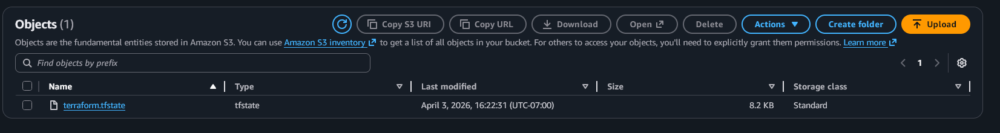
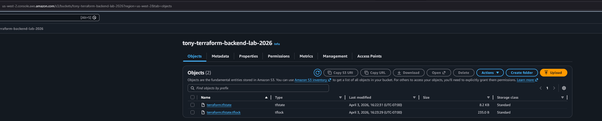

William Wang A01403436
Tony Chou A01373832

## Lab Questions

  ### When is the state file created?

The state file (`terraform/state`) is created in the S3 bucket **after `terraform apply` completes successfully**.


Observations:

- After `terraform init`: Bucket is empty
- After `terraform plan`: Bucket is empty  
- After `terraform apply` completes: State file appears in S3

### When is the lock file present?

Only during `terraform apply`

### Is the lock file always in the bucket after it is created?
No
  

## Screenshots

### State File Only


*Screenshot showing only the state file in the S3 bucket*

  

### Lock File and State File




  

## Files in This Repository

  

```

├── README.md

└── terraform/

    ├── server.tf        # EC2 instance configuration

    └── provider.tf     # AWS provider + S3 backend config

```

  

## Cleanup

  

To clean up the resources:

  

```bash

# Destroy Terraform resources

cd terraform

terraform destroy -auto-approve

  

# Delete the S3 bucket

cd ../scripts

./delete-bucket tony-terraform-backend-lab-2026

```